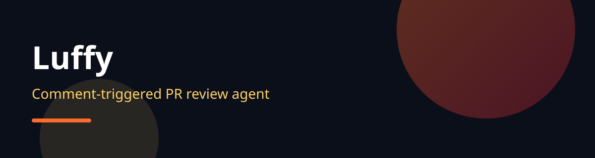
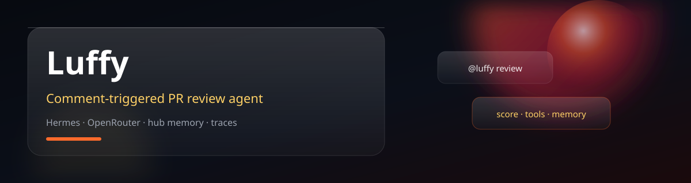
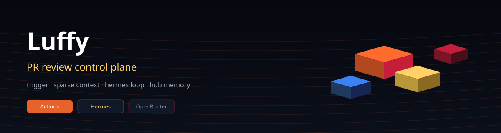
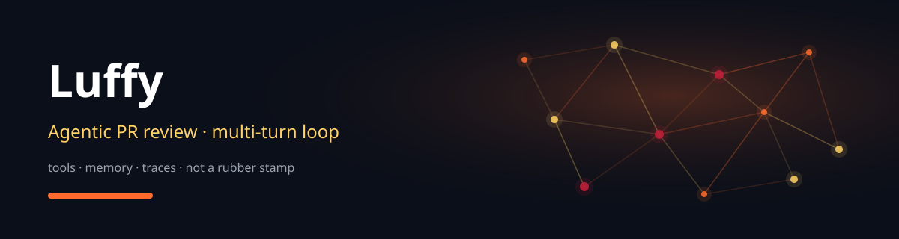
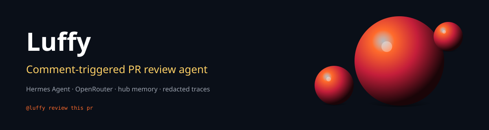
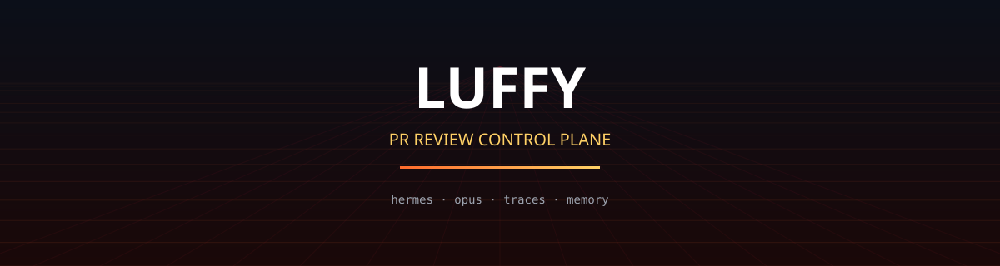
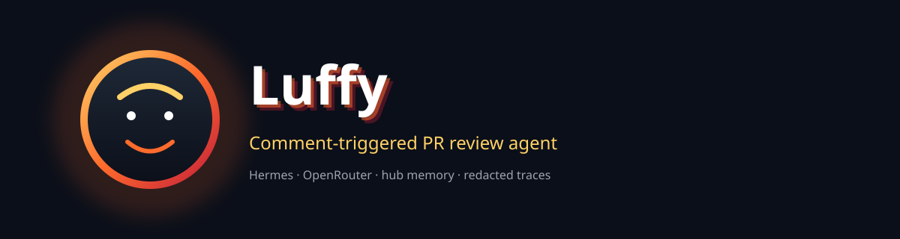
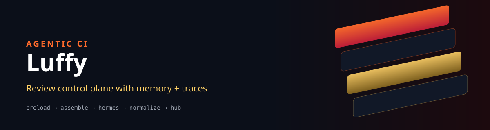

# Brand banner options (review)

Code-generated pure SVG heroes for the Luffy README. Open each file (or view this page on GitHub) and pick a winner.

**Flame palette:** ink `#0B0F19` · flame `#FF6B2C` · crimson `#C41E3A` · gold `#FFD166`

Regenerate:

```bash
node readme-kit/scripts/generate-hero-options.mjs
```

## Recommendation

**Primary pick: B-glass** — reads like a modern product card, uses glass depth + specular orb, still regenerable from tokens, works well at README width.

**Runner-up: E-volumetric** — strongest “3D ball” look without a real 3D runtime.

**Runner-up: H-cinematic** — bold marketing split; good if you want “agentic CI” energy.

A is the control (current style). C/D/F/G are distinct directions if you want isometric, mesh, cyber, or mark-led.

---

## A-baseline — Baseline (current style)



Path: [`assets/brand-options/hero-A-baseline.svg`](hero-A-baseline.svg)

## B-glass — Glass panels + orbs



Path: [`assets/brand-options/hero-B-glass.svg`](hero-B-glass.svg)

## C-isometric — Isometric control plane



Path: [`assets/brand-options/hero-C-isometric.svg`](hero-C-isometric.svg)

## D-mesh — Neural mesh / agent graph



Path: [`assets/brand-options/hero-D-mesh.svg`](hero-D-mesh.svg)

## E-volumetric — Volumetric orbs (fake 3D)



Path: [`assets/brand-options/hero-E-volumetric.svg`](hero-E-volumetric.svg)

## F-cyber — Cyber perspective grid



Path: [`assets/brand-options/hero-F-cyber.svg`](hero-F-cyber.svg)

## G-mark — Mark + extruded type



Path: [`assets/brand-options/hero-G-mark.svg`](hero-G-mark.svg)

## H-cinematic — Cinematic split + slabs



Path: [`assets/brand-options/hero-H-cinematic.svg`](hero-H-cinematic.svg)


## After you choose

Tell the agent e.g. **“use B”**. We’ll set:

- `assets/luffy-hero-banner.svg` ← chosen file  
- readme-kit hero generator default / theme hook  
- rebuild README

---

## Three.js artifacts (not banners)

Square product marks / seals / devices — open interactively:

**[three-artifacts.html](three-artifacts.html)** (local: `open assets/brand-options/three-artifacts.html`)

| # | Artifact |
|---|----------|
| 1 | Monogram L seal |
| 2 | Orbital core |
| 3 | Control seal (rec) |
| 4 | Stacked data planes |
| 5 | Flame crystal |
| 6 | Torus knot (loop) |
| 7 | Review chip / device |
| 8 | Anchor ring |

Drag to orbit · **Save PNG** downloads a still for README use.
